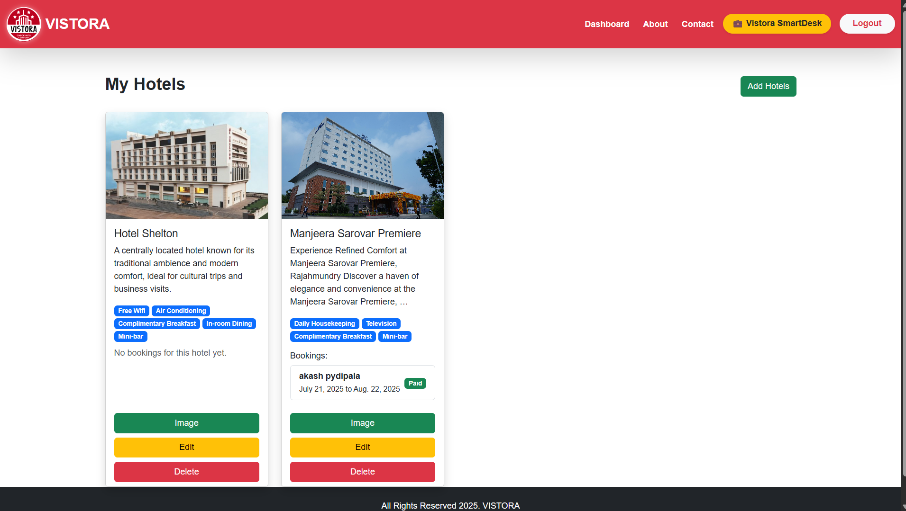

# 🏨 Vistora - Check Into Comfort

Vistora is a full-stack Django-based web application that offers a smart hotel booking platform with integrated AI trip planning, vendor/customer roles, and dynamic booking management. Built to assist users in discovering, booking, and managing stays, it also provides hotel vendors with powerful tools to manage their listings.

## ✨ Features

### 🔹 For Customers
- ✅ User-friendly hotel discovery & booking
- 🧠 AI-powered trip planner using Gemini API
- 💳 Dummy payment gateway simulation
- 🗓️ View, cancel, or delete outdated bookings
- 💬 Real-time travel chatbot using Django REST API

### 🔹 For Vendors
- 🏨 Hotel listing management with dynamic image uploads
- 🎯 Role-based dashboard for managing bookings & offers
- 📈 Slug generation, availability toggles, and more


## 🛠️ Tech Stack

| Component      | Tech Used                          |
|----------------|------------------------------------|
| Backend        | Django 5, Python 3.11               |
| Frontend       | HTML, Bootstrap, JavaScript         |
| Database       | SQLite (for development)            |
| AI Integration | Google Gemini API, Django REST      |
| Payment        | Dummy Payment Simulation            |
| Deployment     | Localhost (with production-ready structure) |

## 📷 Screenshots




## 🚀 Getting Started

### Clone & Setup
```bash
git clone https://github.com/Suryareddy180/vistora.git
cd vistora
pip install -r requirements.txt
python manage.py makemigrations
python manage.py migrate
python manage.py runserver


```
#📁 Project Structure
``` bash
vistora/
├── accounts/        # Vendor & user management
├── home/            # Core views: booking, trip planning, search
├── static/          # JS, CSS, images
├── templates/       # All frontend templates
├── media/           # Uploaded hotel images
├── db.sqlite3       # Local dev database
└── manage.py
```
###🧑‍💻 Author
N.Surya Prakash Reddy

###LinkedIn:https://www.linkedin.com/in/nsprakashreddy/


Let me know if you want:
- Deployment steps for **Render/Heroku/Vercel**
- A license badge or GitHub actions badge
- Upload-ready screenshots (just share if you want me to generate them)

